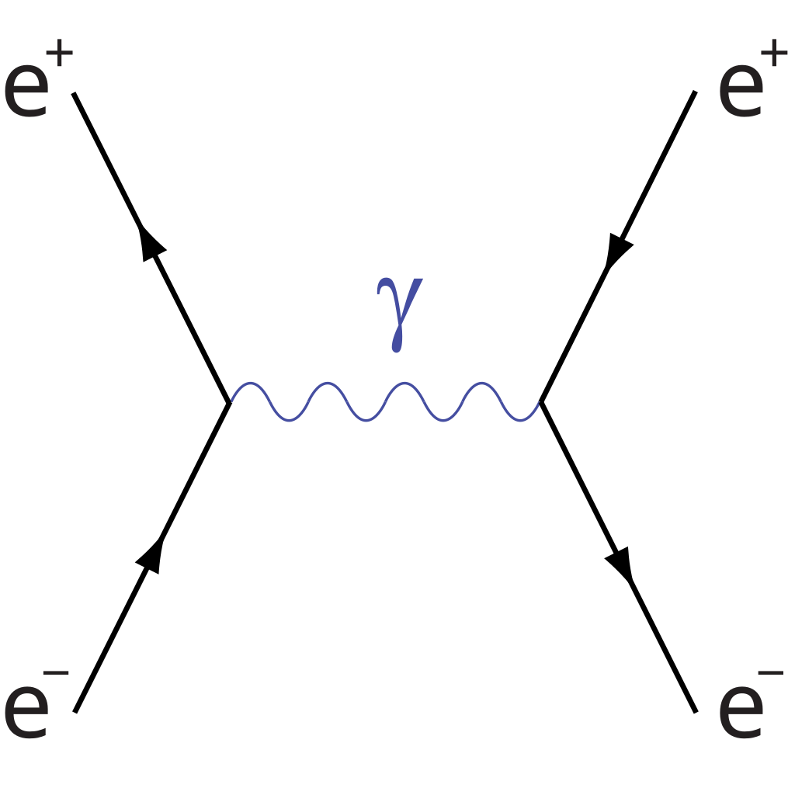

# Yonis Hassan

Aspiring Scholar  
Based in London  
BSc Physics with Data Science | Queen Mary University of London  
[yonishassan267@gmail.com](mailto:yonishassan267@gmail.com)  | [LinkedIn](https://www.linkedin.com/in/yonishassan267/) | [Website](https://yonishassan.github.io/ )

---

## Projects and Research

### Modelling Electrostatic Penetration Energy

- Dissertation project focused on non-classical electrostatics in molecular interactions.
- Modelled electrostatic penetration energy using advanced computational methods.
- Aimed at improving physical accuracy in molecular simulations.

### Predicting Car Acceptability Using Categorical Features

- Built and tuned Random Forest and MLP classifiers using the UCI Car Evaluation dataset.
- Achieved up to 98.8% accuracy through hyperparameter tuning and SMOTE for class balancing.
- Emphasised performance on imbalanced multiclass classification.

### Pulsar Star Classification from Signal Data

- Developed a decision tree classifier to distinguish pulsars from non-pulsars in HTRU2 data.
- Reached 96.7% accuracy using stratified k-fold cross-validation and ROC analysis.
- Focused on interpretability and signal-based pattern recognition.

### JWST Image Analysis Project

- Advanced image processing and analysis of James Webb Space Telescope data
- Astronomical data visualization and computational imaging techniques
- Applied machine learning methods to celestial object detection and classification

### Emotion Detection from Speech and Text

- Developed models to recognise emotions using audio and text data.
- Combined classical ML and deep learning for multimodal analysis.
- Focused on practical applications in human-computer interaction.

### Physics-Informed Neural Networks for Solving Differential Equations
- Used neural networks with embedded physical laws (PINNs) for solving PDEs.
- Applied to problems in physics and engineering contexts.
- Bridged data-driven models with governing equations.

### Portfolio Website
- Created a personal website to showcase projects, writing, and research.
- Focused on clean design, responsive layout, and accessibility.
- Served as a central hub for academic and creative work.

Find more in my repositories 

---

## Currently Exploring

- Scientific computing in Python  
- Data storytelling and visualisation  
- Reproducibility and open-source collaboration in research

Open to new opportunities and collaborations in datascience and physics.

---

## Project Gallery

  
  
  
  
  

--- 
Malcolm X's Letter From Mecca (April 20, 1964) by Malcolm X (Malik el-Shabazz)

Never have I witnessed such sincere hospitality and the overwhelming spirit of true brotherhood as practiced by people of all colors and races here in this Ancient Holy Land, the home of Abraham, Muhammad and all other prophets of the Holy Scriptures. For the past week, I have been utterly speechless and spellbound by the graciousness I see displayed all around me by people of all colors.

I have been blessed to visit the Holy City of Mecca. I have made my seven circuits around the Ka'ba, led by a young Mutawaf named Muhammad. I drank water from the well of Zem Zem. I ran seven times back and forth between the hills of Mt. Al-Safa and Al-Marwah. I have prayed in the ancient city of Mina, and I have prayed on Mt. Arafat. There were tens of thousands of pilgrims, from all over the world. They were of all colors, from blue-eyed blonds to black skin Africans. But we were all participating in the same rituals, displaying a spirit of unity and brotherhood that my experiences in America had lead me to believe never could exist between the white and non-white. America needs to understand Islam, because this is the one religion that erases from its society the race problem.

Throughout my travels in the Muslim world, I have met, talked to, and even eaten with people who in America would have considered 'white'— but the 'white' attitude was removed from their minds by the religion of Islam. I have never before seen sincere and true brotherhood practiced by all colors together, irrespective of their color.

You may be shocked by these words coming from me. But on this pilgrimage, what I have seen, and experienced, has forced me to re-arrange much of my thought patterns previously held, and to toss aside some of my previous conclusions. This was not too difficult for me. Despite my firm convictions, I have always been a man who tries to face facts, and to accept the reality of life as new experiences and new knowledge unfolds it. I have always kept an open mind, which is necessary to the flexibility that must go hand in hand with every form of intelligent search for truth. During the past eleven days here in the Muslim world, I have eaten from the same plate, drunk from the same glass, and slept in the same bed, (or on the same rug)—while praying to the same God—with fellow Muslims, whose eyes were the bluest of blue, whose hair was the blondest of blond, and whose skin was the whitest of white. And in the same words and in the actions and in the deeds of the 'white' Muslims, I felt the same sincerity that I felt among the black African Muslims of Nigeria, Sudan and Ghana.

We were truly all the same (brothers)—because their belief in one God had removed the 'white' from their minds, the 'white' from their behavior, and the 'white' from their attitude. I could see from this, that perhaps if white Americans could accept the Oneness of God, then perhaps, too, they could accept in reality the Oneness of Man—and cease to measure, and hinder, and harm others in terms of their differences in color. With racism plaguing America like an incurable cancer, the so-called 'Christian' white American heart should be more receptive to a proven solution to such a destructive problem. Perhaps it could be in time to save America from imminent disaster—the same destruction brought upon Germany by racism that eventually destroyed the Germans themselves.

Each hour here in the Holy Land enables me to have greater spiritual insights into what is happening in America between black and white. The American Negro never can be blamed for his racial animosities—he is only reacting to four hundred years of conscious racism of the American whites. But as racism leads America up the suicide path, I do believe, from the experience that I have had with them, that the whites of the younger generation, in the colleges and universities, will see the handwriting on the wall and many of them will turn to the spiritual path of truth—the only way left to America to ward off the disaster that racism inevitably must lead to.

Never have I been so highly honored. Never have I been made to feel more humble and unworthy. Who would believe the blessings that have been heaped upon an American Negro? A few nights ago, a man who would be called in America a 'white' man, a United Nations diplomat, an ambassador, a companion of kings, gave me his hotel suite, his bed. By this man, His Excellency Prince Faisal who rules this Holy Land, was made aware of my presence here in Jedda. The very next morning, Prince Faisal's son, in person, informed me that by the will and decree of his esteemed father, I was to be a State Guest. The deputy Chief of Protocol himself took me before the Hajj Court. His Holiness Sheikh Muhammad Harkon himself okayed my visit to Mecca. His Holiness gave me two books on Islam, with his personal seal and autograph, and he told me that he prayed that I would be a successful preacher of Islam in America. A car, a driver, and a guide, have been placed at my disposal, making it possible for me to travel about this Holy Land almost at will. The government provides air conditioned quarters and servants in each city that I visit. Never would I have even thought of dreaming that I would ever be a recipient of such honors—honors that in America would be bestowed upon a King—not a Negro. All praise is due to Allah, the Lord of all the Worlds.

Sincerely, El-Hajj Malik El-Shabazz (Malcolm X)
